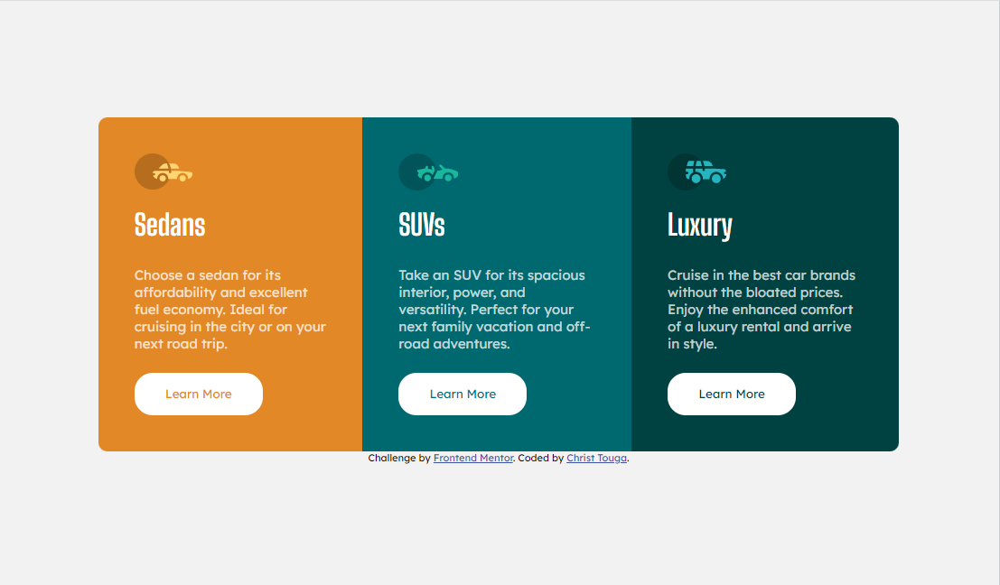

# Frontend Mentor - 3-column preview card component solution

This is a solution to the [3-column preview card component challenge on Frontend Mentor](https://www.frontendmentor.io/challenges/3column-preview-card-component-pH92eAR2-).  

## Table of contents

- [Overview](#overview)
  - [The challenge](#the-challenge)
  - [Screenshot](#screenshot)
  - [Links](#links)
- [My process](#my-process)
  - [Built with](#built-with)
  - [What I learned](#what-i-learned)
  - [Continued development](#continued-development)
  - [Useful resources](#useful-resources)
- [Author](#author)
- [Acknowledgments](#acknowledgments)


## Overview

### The challenge

Users should be able to:

- View the optimal layout depending on their device's screen size
- See hover states for interactive elements

### Screenshot



### Links

- Solution URL: [Add solution URL here](https://your-solution-url.com)
- Live Site URL: [Add live site URL here](https://your-live-site-url.com)

## My process

### Built with

- Semantic HTML5 markup
- CSS custom properties
- Flexbox
- [Styled Components](https://styled-components.com/) - For styles

### What I learned

I used button tags for the first time in this project. I feel confortable with buildin the DOM.
I also feel like if my CSS file would have been shorter if i was able to code in javascript. 
But i'm not yet able to build web-apps witth javascript(still to come ;)).
I'm happy that i could use the following CSS
````
article div:last-of-type {
        display: flex;
        flex-direction: column;
        justify-content: space-between;
        flex: 1 0 auto;
    }
````
This CSS helped me to make that all the buttons stay in the same row. By pushing them at the end(position) of the articles(main-child).

### Continued development

- Improve my flexbox skills
- Improve responsive design
- Learn and use my grid skills

### Useful resources

- [Flexbox - CSS Tricks](https://css-tricks.com/snippets/css/a-guide-to-flexbox/) - This is very helpful when i build a flexbox

## Author

- Website - [Christ Touga](https://www.linkedin.com/in/christ-k%C3%A9vin-touga-watat-32026712a?lipi=urn%3Ali%3Apage%3Ad_flagship3_profile_view_base_contact_details%3BjJWnqFGfRGyI%2FPm5Rzm0dw%3D%3D)
- Frontend Mentor - [@Christ-Kevin](https://www.frontendmentor.io/profile/Christ-Kevin)
- Twitter - [@WatatK](https://www.twitter.com/WatatK)
